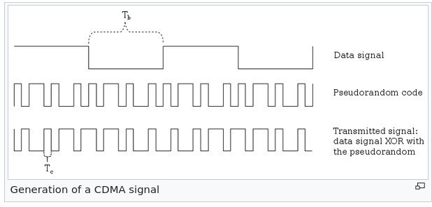

# CDMA Visualization
Python simulation of Code-Division Multiple Access encoding

This library and demonstration shows the inner workings of a CDMA telecommunication system. 
One can see and interact with the crucial steps for CDMA.

## CDMA
Code-Division Multiple Access is a Spread-Spectrum technique that broadens the frequency spectrum of a 
message using an access code. Multiple messages can then be mixed and sent simultaneously using the same frequency band. It is heavily used in the mobile communications industry to serve many clients on the same allocated band. It is also used in GNSS (geolocation via satellite) systems, so that a single receiver (user) can receive data from multiple satellites.

A good way to get a feel for how CDMA works is by the human language analogy. Think of the following scenario: there are 3 people around you, two are speaking languages you don't understand, but one is.
Your brain can easily pick up and focus on the one you know. Why? Think of it as your brain using the patterns in the language (e.g: syllables), and using that extra information on the pattern to exclude non-fitting data (perceived as noise). What CDMA does is it adds a pattern to the data, the code. The code is a sequence that is encoded in every transmitted bit and is unique for the sender. The properties of the code of orthogonality and self correlation are what enables the "focusing". 

While it can be simple to accept this explanation its very hard to understand it fully. For example, what happens to actual noise? How many transmitters can share this band? How the code is created? To answer those questions the best tool is an interactive simulation where you can "feel" the system.

### Access Code
The code generation is in a separate file, a notebook. The theory behind the code is much too complicated to fully explain. Check a good textbook to learn it fully. The gist is that the code is a group of bits that must have the properties of low cross-correlation, high self-correlation, balance of zeros and ones and orthogonality. To achieve this mathematics provides us with Galois Fields, those fiel ds can be implemented (surprisingly simply) with a Linear Feedback Shift Register (LFSR). Even among this family of codes there are special sequences, for example GPS uses the Gold Code, that mixes multiple LFSRs. 